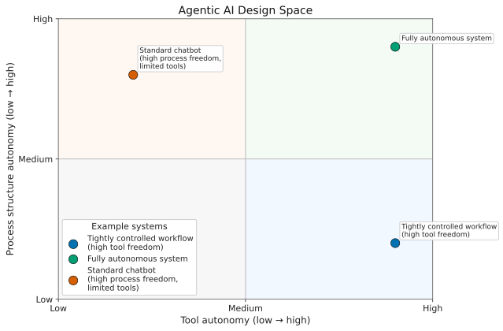
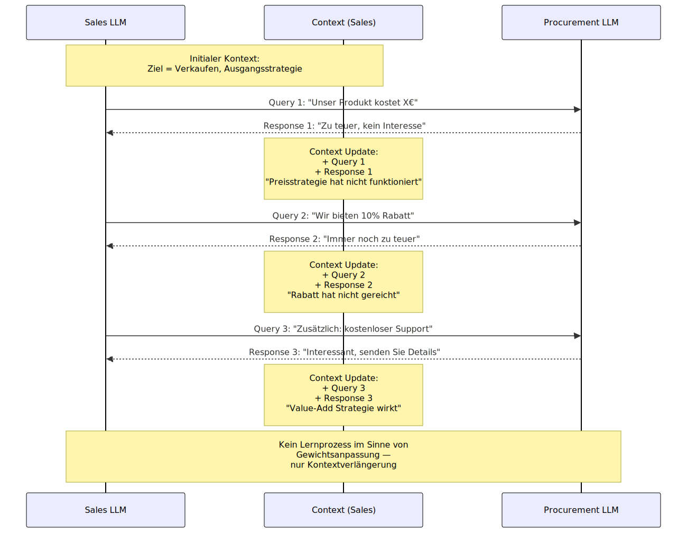

<!-- _class: lead -->

# Agentic AI (J. Vogt, 2026)

### Zielsetzung

- Fokus: Begriffliche Einordnung und technische Grundlagen
- Ergebnis: Sie können den Aufbau einer einfachen agentischen AI-Anwendung erklären und selbst eine App konzipieren.

 ### Content

 - AI Agenten und agentische Systeme
 - Autonomie
 - Umsetzung in Python

---

# AI Agenten

### Definition durch Unterscheidung von "One-Shot"-Abfragen 

- Das System können **wahrnehmen** (insbesondere über Tools), **handeln** (Tools nutzen), **Ergebnisse beobachten** und **nachsteuern**
- Kerncharakterisika: Iterationen und Tool-Use 

---

<!-- _class: small -->

# Rolle von Tools

- Durch Tools kann das System:
  - Daten abrufen
  - Programme ausführen
  - Dateien ändern
  - APIs ansprechen
  - Wirkungen in der Umwelt erzeugen

---

<!-- _class: small -->

# Agentische AI Systeme..

- ..bestehen aus mehreren Agenten, die kollaborativ komplexe Ziele verfolgen.
- Dabei können einzelnen Agenten z.B. koordinieren und andere granularere Arbeitsschritte  ausführen.
- Grds. ist dabei ein hohes Maß an Autonomie möglich, worauf wir im Folgenden eingehen.
**Sum-Up:** Neben Iterationen und Tool-Use nun auch Orchestrierung / Zusammenspiel wichtig!

---
# Rollen der einzelnen Agenten

---
<!-- _class: small -->

# Autonomie..

- ..wird oft als zwingendes Charakterisikum von agentischen Workflows beschrieben.
- ABER: Konkrete Vorgaben zu Feedback-Loops können die Autonomie gegenüber klassischem One-Shot-Prompting in mancher Hinsicht reduzieren—zugunsten einer höheren Auditierbarkeit.
- Sinnvoll, **Autonomie differenziert zu betrachten** im Hinblick auf
    - Funktionale Autonomie in einem einzelnen Prozessschritt
    - Workflow-Autonomie (insb. in Bezug auf Evaluationsschritte) 

- Viel funktionale Autonomie heißt **nicht automatisch** viel Entscheidungsfreiheit. 

---
# Agentic AI Design Space

<!-- ---

# Was ist nicht entscheidend?

- **Nicht nötig:** mehrere LLMs
- **Nicht nötig:** völlige Freiheit des Systems
- **Nicht nötig:** unkontrolliertes Handeln

Ein System kann **klar begrenzt** sein und trotzdem agentisch arbeiten,  
solange es **selbstständig im Loop** wahrnimmt, handelt und nachjustiert. -->

---

# Weitere in der Literatur diskutierte Charakteristika sind..

- ..die Lernfähigkeit und ein gemeinsames Gedächtnis eines agentischen Systems.
- Dabei können auch LLM-Gewichte angepasst werden (z.B. im Falle von Multi-Agent Reinforcement Learning (MARL)).
- Da das rechenintesiv ist werden aber oft lediglich neue Information / Erfahrungen. gespeichert. 
- Das kann anderem durch Datenbank-Tools ermöglicht werden. 
- Besonders wichtig ist aber die sequenzuielle Erweiterung des Kontexts erreicht (In-context Learning (ICL)).
---

# Multi-Agent In-context Learning

---

<!-- 
# Kurzdefinition für Studierende

- Agentic AI = ein LLM-basiertes System,
- das mit **Tools** arbeitet,
- **Aktionen** ausführt,
- **Ergebnisse beobachtet**
- und sein Verhalten **iterativ anpasst**

**Nicht zentral:** Anzahl der LLMs  
**Zentral:** **Loop + Toolnutzung + selbstständige Ausführung**

--- -->