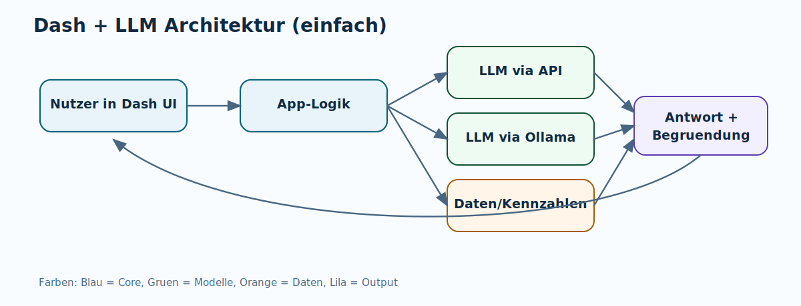

<!-- _class: lead -->

# Schnelle AI-Apps mit Dash (J. Vogt, 2026)

### Zielsetzung

- Fokus: Verstehen statt Programmierdetails
- Ergebnis: Sie können den Aufbau einer Dash+LLM-App erklären und selbst eine App konzipieren.

 ### Content

 - Dash
 - Einbinden von LLMs
 - Systemarchitektur


---

<!-- _class: chapter -->
# Kapitel 1 - Einführung in Dash

---


<!-- _class: small -->

#  Dash ist eine..


- Python-Library zum Erstellen interaktiver Web-Dashboards für Python-Programme


- Dash basiert auf Flask, einem Client-Server-Framework. Der Python-Server wartet auf Informationen, die über einen Browser (Client) in Form von JSON-Objekten (ein sehr flexibles Datenformat) übermittelt werden, und sendet Daten zurück.

- Beim Start einer Dash-App wird eine leere HTML-Seite erzeugt. Der Server stellt JSON-Daten mit Informationen über den Seitenaufbau bereit, die durch eine JavaScript-Bibliothek (React.js) in HTML übersetzt werden (Rendering).


---


# Typischer Workflow

1. In Python wird Aufbau einer Seite über Dash-Elemente festgelegt (z.B Tabllen mit Finanzdaten für ein Unternehmen).
2. Einige Bestandteile ermöglichen Nutzereingaben (z.B. Unternehmensnahmen).
3. Nutzereingaben werden an Python-Funktionen übergeben, die Berechnen durchführen und Anpassungen an der HTML-Struktur initiieren könne (z.B. Daten für neue Firma oder zusätzliche Grafik.)


---
<!-- _class: small -->

# Die drei Bausteine von Dash

- Oberfläche: Was Nutzer sehen und anklicken bzw. grundsätzliche HTML-Struktur
- Zustand: Welche Eingaben gerade gelten bzw. welche Infos übergibt der Nutzer an das Dashboard
- Reaktion: Was bei Klick oder Änderung passiert bzw. welche Python-Funktionen im Hintergrund getriggert werden, die z.B. Daten an den Client zurückgeben (z.B. neue Infos an die Javascript Library, die dann die HTML-Struktur änder / ergänzen).


---


# Grundstruktur einer Dash-App (1/2)

```python
# 1. App starten
app = Dash(__name__)

# 2. Layout: Was der Nutzer sieht
app.layout = html.Div([

    # Eingabe-Elemente
    dcc.Dropdown(id="firma", options=["Apple", "Meta"]),
    dcc.Textarea(id="frage", placeholder="Frage eingeben..."),
    html.Button("Senden", id="btn"),

    # Ausgabe-Elemente
    dcc.Graph(id="grafik"),
    html.Div(id="antwort"),
])
```

---

# Grundstruktur einer Dash-App (2/2)

```python
# 3. Callback: Was passiert bei Eingabe
@app.callback(
    Output("antwort", "children"),   # Was wird aktualisiert?
    Input("btn", "n_clicks"),        # Was löst es aus?
    State("frage", "value"),         # Was wird mitgelesen?
)
def auf_klick(n_clicks, frage):
    return f"Deine Frage: {frage}"

# 4. App starten
app.run()
```

> **Merksatz:** `Input` löst aus — `State` liest mit — `Output` schreibt zurück.

---

<!-- _class: chapter -->
# Kapitel 2 - Einbinden von LLMs in Python

---

<!-- _class: small -->

# LLM-Einbindung: Drei Wege (1/2)

## 1) OpenRouter (API-Hub)
- **OpenRouter (API-Hub)**
- Ein API-Key, viele Modelle (z. B. OpenAI, Anthropic, Mistral)
- Plus: ein Key, viele Modelle, teils gratis (Free-Tier)
- Minus: je nach Modell/API laufende Kosten, Daten nicht mehr nur lokal

## 2) OpenAI (direkt)
 - Direkte Anbindung an GPT-Modelle
  - Einfaches, stabiles API-Setup für Produktion

- Plus: sehr stabile Cloud-API, starke Modelle
- Minus: kostenpflichtig, Daten nicht mehr nur lokal

---

<!-- _class: small -->

# LLM-Einbindung: Drei Wege (2/2)

## 3) Ollama (lokal / on-prem)
  - Modelle laufen auf dem eigenen Rechner
  - Datenschutz-freundlich, offline möglich, aber langsamer/ressourcenintensiver
- Verfübgar z.B. Mistral, Llama, Qwen (Alibaba), Gemma (Google), Phi (Microsoft)
- Plus: lokal, keine API-Kosten, offline möglich
- Minus: Hardwarebedarf, Modellqualität/Speed abhängig vom Rechner, viele Anbieter bieten nur API Zugang an

---

<!-- _class: chapter -->
# Kapitel 3 - Architektur 


---

<!-- _class: small -->

# Vier Ebenen

- Frontend in Dash: Formulare, Buttons, Diagramme
- Orchestrierung: Welche Funktion wann startet
- Intelligenz: LLM (API oder Ollama)
- Datenbasis: Dateien, Vektor-DB, Kennzahlen



---
<!-- _class: small -->

# RAG kurz erklärt 

1. Frage in Wörter zerlegen  
2. Dokument in Chunks teilen  
3. Relevanz-Score je Chunk vor dem Hintergrund der Frage  
4. Top-k Chunks als Kontext an LLM geben
5. Die relevantesten Chunks werden zusammen mit der Query und ggf. noch weiteren Infos als Kontext an das LLM übergeben.

Die Relevanz kann im einfachsten Fall über die Anzahl an Token-Überschneidungen quantifiziert werden. Komplexer aber verbreiteter ist das Abschätzen der Relevanz über das Errechnen der Vektordistanz zwischen dem durchschnittl. Embenddingvektoren der Frage und der Chunks.

---
<!-- _class: small -->

# Was wird an das LLM übergeben?

1. Zentrale Query
2. Relevanteste RAG-Chunks
3. Möglicherweise weitere relevante Daten.
4. Instructions (z.B. zur Perspektive, aus der das LLM die Antwort verfassen soll)
---


# Was baut man zuerst?

## MVP-Backlog (nicht-technisch)

1. Eine klare Nutzerrolle (z. B. Analyst)
2. Eine Kernfrage (z. B. "Warum weicht Multiple von Peer-Group ab?")
3. Ein klickbarer Flow mit 1-2 Outputs
4. Ein Bewertungsmaßstab für Antwortqualität

Vermeidet Feature-Sammeln in der ersten Version.

---

# Schritt-für-Schritt zur App

1. Use Case eingrenzen
2. Inputs definieren (Dropdowns, Textfeld, Zeitraum)
3. Ziel-Ausgabe definieren (Zusammenfassung, Chart, Quellen)
4. LLM-Route wählen (API oder Ollama)
5. Prompt-Struktur standardisieren
6. Qualität mit Testfragen prüfen
7. Mit 3-5 Nutzern iterieren

---
<!-- _class: small -->

# Diskussionsfragen

- Welche Entscheidung in Ihrem Fachbereich könnte so eine App verbessern?
- Wo wäre lokale AI Pflicht?
- Welche 3 Qualitätskriterien sollte eure App immer erfüllen?

---

# Abschluss

## Nächster Schritt

Bauen Sie als Team in 90 Minuten einen "One-Question-MVP":
Eine Nutzerfrage, ein Button, eine belastbare Antwort mit Quelle.
